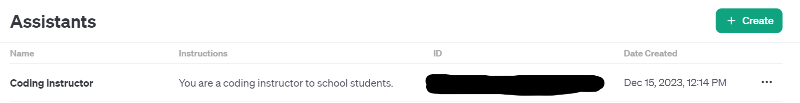
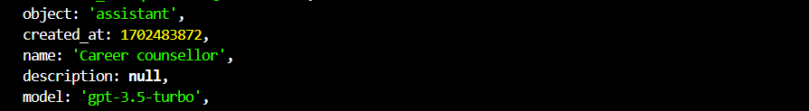
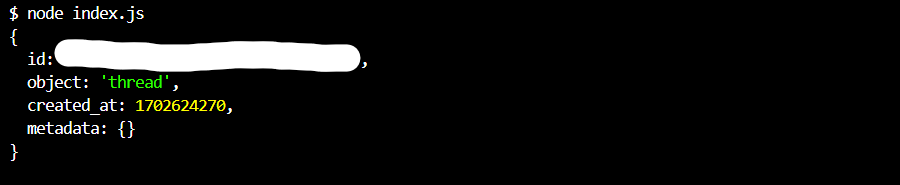
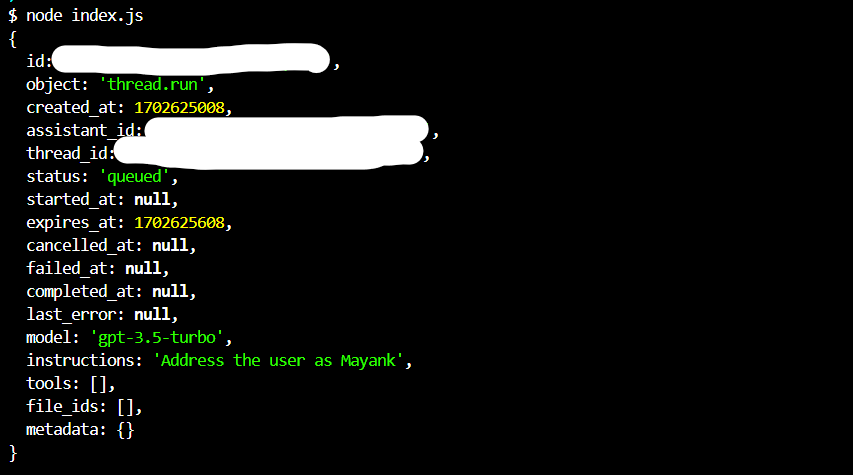
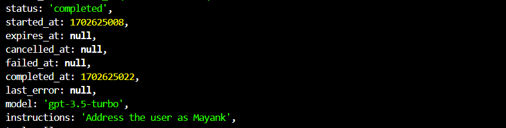
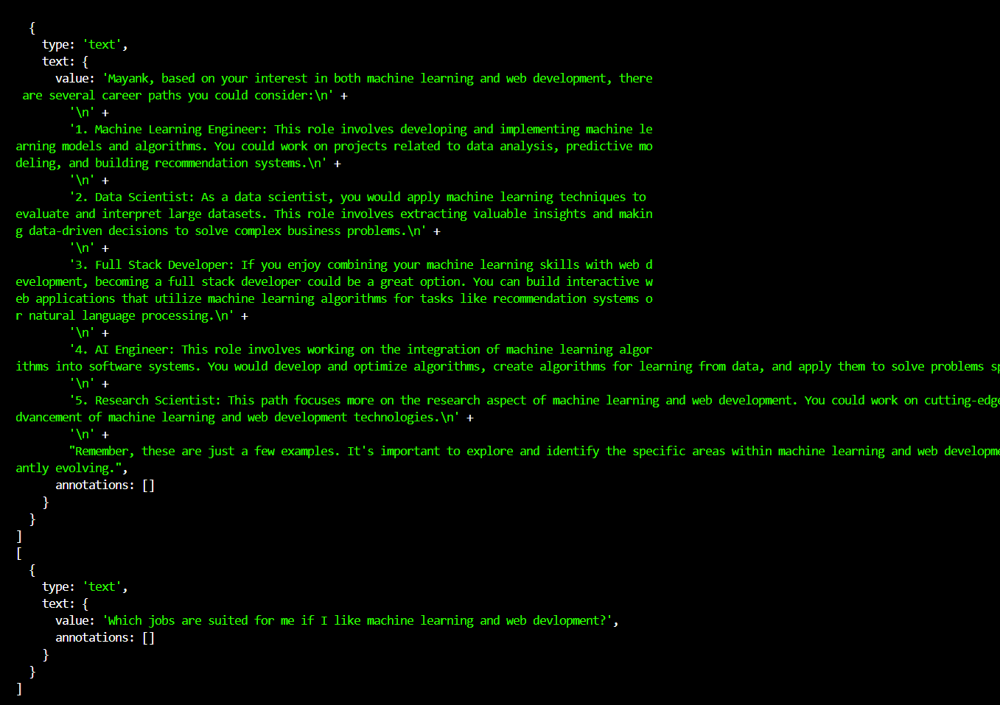
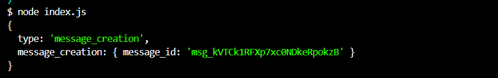

# How the code works

- I have kept all my Id's in .env file for security purpose, and also covered it in my images.
- To start using this project, go to the root of folder and type
~
```
npm install
```

### Creating an assistant
- The first code with no. 1 as comments shows how to create a new assistant with your own touch to it.

- To create such assistant, get the code for it and run the file

```
node filename.js
```


### Retreiving an assistant
- The second code tells the way on how to retreive an assistant back with it's id.

- You can also store the id of the assistant in DB, to access further.

```
node filename.js
```


### Creating a new thread
- Also you can store the thread, and assistant id, to fetch later on to get the sessions
- Comments clearly specify in index.js how to create a new thread


### Creating a new message
- Create a new message and run and it gives the status of 'queued' at first.


- Then after litte time it gives the status as 'completed' meaning the message is also generated.


### Accessing the message from the object
- The forEach loop under comment no.6 shows how to fetch the messages.


### Fetching logs
